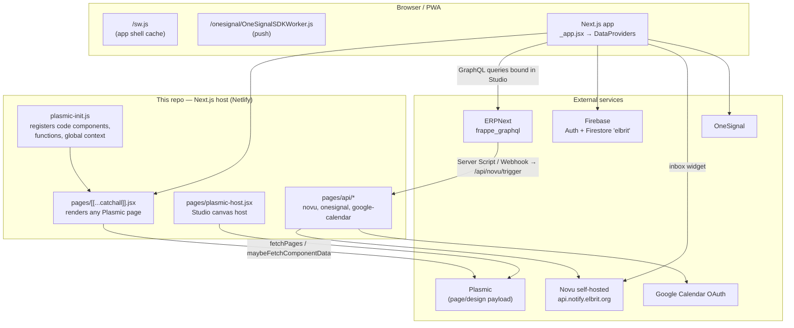

# Elbrit One — Knowledge Transfer

Handover document for the **Elbrit One** web app (this repository).
Last verified against `main` @ `4f998da`.

---

## 0. Scope of this document

**In scope** — everything owned by *this* repo: the Next.js host, the Plasmic
integration, the root `components/`, `pages/`, `lib/`, `hooks/`, `scripts/`,
`resource/`, `public/`, build/deploy, env, notifications, auth, PWA.

**Out of scope (deliberately)** — the [share/](share/) and [shared/](shared/)
folders. Those are **vendored copies of a different repository**
(`elbrit-dev/playground`) and are documented separately. This document explains
*how they are wired in* and *what the host expects from them*, but not their
internals.

---

## Contents

1. [What the app is](#1-what-the-app-is)
2. [Stack at a glance](#2-stack-at-a-glance)
3. [Architecture](#3-architecture)
4. [Repo map](#4-repo-map)
5. [How a page renders](#5-how-a-page-renders-routing--lifecycle)
6. [The Plasmic layer](#6-the-plasmic-layer--the-core-concept)
7. [Data layer — ERPNext GraphQL](#7-data-layer--erpnext-frappe-graphql)
8. [Auth & identity — Firebase](#8-auth--identity--firebase)
9. [Notifications — Novu + OneSignal](#9-notifications--novu--onesignal)
10. [PWA, service workers, offline](#10-pwa-service-workers-offline)
11. [API routes](#11-api-routes)
12. [Root code-component catalogue](#12-root-code-component-catalogue)
13. [Environments, env vars, build & deploy](#13-environments-env-vars-build--deploy)
14. [Local dev setup](#14-local-dev-setup)
15. [Recipes — common tasks](#15-recipes--common-tasks)
16. [Gotchas & tribal knowledge](#16-gotchas--tribal-knowledge)
17. [Known debt & open items](#17-known-debt--open-items)
18. [Doc index](#18-doc-index)

---

## 1. What the app is

**Elbrit One** is the field-force / sales-operations PWA for Elbrit
(`app.elbrit.org`, UAT at `app-uat.elbrit.org`). Users are BEs (business
executives), ABMs/RBMs/SMs (managers) and HQ/IT staff. It covers:

- **Calendar / Planner** — doctor visits, meetings, tour plans, leave, todos.
- **Secondary data entry + approval chain** — distributor secondary sales & closing stock.
- **Approvals** — operational-tracker driven approve / reject / revisit.
- **Product catalogue & stock** — brand cards, variants, per-warehouse and per-batch stock.
- **Datatables / reports** — generic GraphQL-backed tables, grouping, export.
- **Notifications** — in-app inbox (Novu) + web push (OneSignal).

The critical architectural fact: **the UI is built in Plasmic Studio, not in
this repo.** This repo is the *host*: it supplies the Next.js runtime, the
"code components" that Studio composes, the helper functions Studio calls, and
the backend glue (API routes, Firebase, Novu). Pages, layouts and most data
bindings live in the Plasmic project and change without a code deploy.

---

## 2. Stack at a glance

| Layer | Choice |
| --- | --- |
| Framework | Next.js **16.0.10**, **Pages Router** (`pages/`), React 19.2.1 |
| Visual builder | Plasmic **headless loader** (`@plasmicapp/loader-nextjs`) |
| Backend / data | **ERPNext (Frappe)** via `frappe_graphql` |
| Auth | **Firebase Auth** (Google + Phone), FirebaseUI |
| App DB (side data) | **Firestore**, non-default database named `elbrit` |
| Notifications | **Novu** (self-hosted, `notify.elbrit.org`) + **OneSignal** web push |
| UI kits | PrimeReact (primary), Tailwind v4, Radix primitives, lucide-react, antd (present), framer-motion |
| Tables | PrimeReact DataTable — two implementations (see §12) |
| Editors / misc | TipTap, Quill, GraphiQL (in-app playground), recharts, xlsx, dexie/localforage |
| Hosting | **Netlify** (two deploy contexts: test + live) |
| PWA | manifest + hand-written service worker |

---

## 3. Architecture



The two mental models to hold:

1. **Design-time**: Plasmic Studio loads `https://<site>/plasmic-host`, so the
   designer sees and configures the *real* React components from this repo.
2. **Run-time**: the browser hits any URL → the catch-all page asks Plasmic for
   that path's payload → renders it, instantiating those same components.

---

## 4. Repo map

```
elbrit/
├── pages/                     ← Next.js Pages Router (host-owned routes)
│   ├── [[...catchall]].jsx    ← renders every Plasmic page (SSG + ISR)
│   ├── plasmic-host.jsx       ← Plasmic Studio app host
│   ├── _app.jsx               ← global CSS, $ctx.fn / $ctx.state, SW + OneSignal init
│   ├── _document.jsx          ← preconnects, self-hosted fonts, splash screen
│   ├── google-callback.jsx    ← Google OAuth redirect landing
│   ├── common-datatable-demo.jsx ← playground for CommonDataTable (deletable)
│   └── api/                   ← serverless routes (§11)
├── plasmic-init.js            ← ★ 2.5k lines: the entire code-component registry
├── components/                ← ★ root code components (§12)
│   └── CommonDataTable/        ← self-contained table + README
├── lib/                       ← firebase (modular), onesignal helpers, misc
├── hooks/useSwipeNavigation.js
├── firebase.js                ← root Firebase init (compat SDK)
├── scripts/                   ← release guard, Plasmic MCP server, one-off migrations
├── resource/                  ← static seed data (data.js is empty, target.js is a fixture)
├── public/                    ← manifest, sw.js, OneSignal workers, logos
├── styles/globals.css
├── share/     ← ⚠ vendored from elbrit-dev/playground (OUT OF SCOPE)
├── shared/    ← ⚠ vendored: only `calendar/` (OUT OF SCOPE)
└── *.md / *.pdf               ← existing docs (§18)
```

### How `share/` and `shared/` attach to the host

Four wires, all of them worth knowing:

| Wire | Where | What it does |
| --- | --- | --- |
| `npm run copy-shared` | [package.json:11](package.json#L11) | `degit`s `share/`, `components/`, `shared/` fresh from `elbrit-dev/playground`. **It overwrites those folders** — anything host-specific must live outside them. |
| Path aliases | [jsconfig.json](jsconfig.json) | `@/app/*`→`share/src/app/*`, `@/components/*`→`share/src/components/*`, `@calendar/*`→`shared/calendar/*`, `@/*`→repo root |
| `registerElbritCoreComponents(PLASMIC)` | [plasmic-init.js:2078](plasmic-init.js#L2078) | registers the share-side components into Studio: `DataProvider`, `DataProviderViews`, `DataView`, `DataTableNew`, `Navigation`, `EventTimeline`, `SmartDataProvider`, `SmartDataTable`, `ReportControls` |
| `CalendarPage` | [plasmic-init.js:551](plasmic-init.js#L551) | the whole calendar/planner UI, imported from `@calendar/components/CalendarPage` and given `erpUrl` / `authToken` / `me` as Studio props |

Two host-owned files exist **specifically** so `copy-shared` can't clobber
them: [pages/google-callback.jsx](pages/google-callback.jsx) and
[pages/api/google-calendar/connect.js](pages/api/google-calendar/connect.js).
Both are Pages-Router ports of App-Router files that live upstream — if the
upstream Google-auth flow changes, these two must follow.

There is also one **shim the vendored code depends on**:
[hooks/useSwipeNavigation.js](hooks/useSwipeNavigation.js). `share/`'s
`Navigation.jsx` and `(navigation)/layout.jsx` import
`@/hooks/useSwipeNavigation`, which the `@/*` → repo-root alias resolves to
*this* file (not the copy inside `share/src/hooks/`). Delete it and the
vendored navigation stops building. It implements swipe-left/right page
switching (min 50px, mobile widths only) over a module-level shared
`navigationItems` list.

### 4.1 Scripts, styling and odds and ends

| Thing | Note |
| --- | --- |
| [scripts/release-guard.js](scripts/release-guard.js) | Pre-build gate for production deploys (§6.1). |
| [scripts/mcp-server.js](scripts/mcp-server.js) | Plasmic MCP server, `npm run mcp` (§6.4). |
| [scripts/generate-icons.js](scripts/generate-icons.js) | Optional PWA icon generation from `public/logo.svg` via `sharp`; **exits quietly if `sharp` isn't installed** and is not wired into any npm script. |
| [scripts/import-storage-to-firestore.mjs](scripts/import-storage-to-firestore.mjs) | One-shot importer (Firebase Storage `Test/` → Firestore `test`), `--dry-run` supported. Migration-era, not part of the app. |
| [resource/target.js](resource/target.js) | Static sales-team/HQ target fixture. [resource/data.js](resource/data.js) is an empty array; [function.js](function.js) is an empty file. |
| [styles/globals.css](styles/globals.css) | Tailwind **v4** (`@import "tailwindcss"`), CSS custom properties for background/foreground/card, `@theme inline` mapping, and a `@layer base` rule that protects PrimeReact's `p-*` classes from the Tailwind reset. |
| `.npmrc` | `legacy-peer-deps=true` — required; the dependency set does not resolve with strict peers. |
| `.eslintrc.json` | `next/core-web-vitals` only. |
| `shared.zip` | A committed snapshot of the vendored folder — not used at runtime (§17). |

---

## 5. How a page renders (routing & lifecycle)

**Route resolution order** (standard Next.js): concrete files in `pages/` win,
the catch-all takes everything else.

```
/api/*                  → serverless functions
/plasmic-host           → Plasmic canvas host
/google-callback        → OAuth landing
/common-datatable-demo  → table playground
/<anything else>        → pages/[[...catchall]].jsx → the Plasmic page at that path
```

**[pages/[[...catchall]].jsx](pages/[[...catchall]].jsx)** — the whole app's
page renderer:

- `getStaticPaths` → `PLASMIC.fetchPages()` pre-builds every Plasmic page,
  `fallback: "blocking"` so a page published *after* the build still renders on
  first hit.
- `getStaticProps` → `maybeFetchComponentData(path)`, then
  `extractPlasmicQueryData(...)` so Studio-defined queries are prefetched and
  baked into the HTML. `revalidate: 60` → ISR, content refreshes ~1 min after a
  Plasmic publish, no deploy needed.
- No Plasmic page at that path → `<Error statusCode={404} />`.

**[pages/_app.jsx](pages/_app.jsx)** — everything global:

- Imports all global CSS: Tailwind/globals, primeicons, PrimeReact
  `lara-light-cyan` theme, GraphiQL styles, and the calendar's globals.
- Initializes root Firebase by importing [firebase.js](firebase.js).
- Wraps the tree in **two Plasmic `DataProvider`s** — this is how Studio gets
  its helpers:
  - `$ctx.fn` → utility bag + `setState`
  - `$ctx.state` → the React-state global store written by `$ctx.fn.setState`
- Registers `/sw.js` on `load`.
- Loads the **OneSignal v16 SDK** and calls `OneSignal.init(...)` with
  `appId: 9cc963c3-…` and a **separate worker scope** `/onesignal/` (see §10).
- Drives the splash screen (min display 3s) declared in `_document.jsx`.
- Installs global `error` / `unhandledrejection` handlers that **swallow
  `TypeError` rejections** — historically an auth race condition. Be aware: this
  hides real bugs of that shape.

---

## 6. The Plasmic layer — the core concept

### 6.1 Project, tags and versions

[plasmic-init.js:31-60](plasmic-init.js#L31-L60):

```js
const plasmicTag = process.env.NEXT_PUBLIC_PLASMIC_TAG;   // only "dev" | "prod"
const plasmicVersion = plasmicTag === "prod" ? "prod" : undefined;
```

- **`prod`** → loads only versions published in Studio **with the `prod` tag**.
  Live changes *only* when someone publishes to `prod`.
- **`dev` / unset** → loads the latest publish regardless of tag. So a `dev`
  publish shows on test only; a `prod` publish shows on both.
- Any other value **throws at import time** (deliberate fail-fast).
- `preview: false` — never point production at the unpublished project.

The Plasmic **project id and token are hardcoded** in
[plasmic-init.js:49-50](plasmic-init.js#L49-L50) (a read-only loader token, but
still a checked-in credential — see §17). The `NEXT_PUBLIC_PLASMIC_PROJECT_*`
env vars are used only by the MCP server (§6.4).

**Release guard** — [scripts/release-guard.js](scripts/release-guard.js) runs
before every `next build`:

| `NEXT_PUBLIC_PLASMIC_TAG` | `RELEASE_CHANNEL` | Result |
| --- | --- | --- |
| `dev` | anything | build allowed |
| `prod` | `prod` | build allowed |
| `prod` | anything else | **build blocked (exit 1)** |

So a production deploy is a *two-key* action: tag says prod **and** the release
channel is explicitly armed.

### 6.2 The app host

[pages/plasmic-host.jsx](pages/plasmic-host.jsx) renders `<PlasmicCanvasHost/>`.
The Plasmic project must be configured with its app-host URL pointing here
(`http://localhost:3000/plasmic-host` for local work,
`https://app-uat.elbrit.org/plasmic-host` etc. for the deployed ones). Without
it, Studio can't see any of the code components.

### 6.3 What this repo exposes to Studio

**(a) Code components** — `PLASMIC.registerComponent(...)`. From this repo:

| Studio name | File |
| --- | --- |
| `FirebaseUIComponent` | [components/FirebaseUIComponent.jsx](components/FirebaseUIComponent.jsx) |
| `CalendarPage` | `@calendar/components/CalendarPage` (vendored) |
| `NovuInbox` | [components/NovuInbox.jsx](components/NovuInbox.jsx) |
| Push Notification Toggle | [components/PushNotificationToggle.jsx](components/PushNotificationToggle.jsx) |
| Network Banner | [components/NetworkBanner.jsx](components/NetworkBanner.jsx) |
| Device Primary Guard | [components/DevicePrimaryGuard.jsx](components/DevicePrimaryGuard.jsx) |
| Approval Card | [components/ApprovalCard.jsx](components/ApprovalCard.jsx) |
| Secondary Summary Card | [components/SecondaryDataSummary.jsx](components/SecondaryDataSummary.jsx) |
| Secondary Approval Summary Card | [components/SecondaryApprovalSummary.jsx](components/SecondaryApprovalSummary.jsx) |
| Product Card | [components/ProductCard.jsx](components/ProductCard.jsx) |
| Product Stock Sheet | [components/ProductStockSheet.jsx](components/ProductStockSheet.jsx) |
| Catalog Letter Section / Catalog Letter Group | [components/CatalogLetterSection.jsx](components/CatalogLetterSection.jsx), [components/CatalogLetterGroup.jsx](components/CatalogLetterGroup.jsx) |
| Home Nav Rings / Progress Ring | [components/HomeNavRings.jsx](components/HomeNavRings.jsx), [components/ProgressRing.jsx](components/ProgressRing.jsx) |
| Common DataTable | [components/CommonDataTable/CommonDataTable.jsx](components/CommonDataTable/CommonDataTable.jsx) |

Plus the nine share-side ones via `registerElbritCoreComponents` (§4).

**(b) Functions** — callable in Studio expressions as `$$.<name>(...)`:

`jmespath`, `jmespath_plus`, `jsonata`, `addStHq`, `useState`, `useEffect`,
`useCallback`, `useMemo`, `useRef`, `setGlobalState`, `getGlobalState`.

> `addStHq` ([plasmic-init.js:88](plasmic-init.js#L88)) is real business logic
> living in the host: given an item→sales-team map and a customer→team map, it
> resolves a row's `sales_team` + `hq`, honouring each team's
> `valid_from`/`valid_to` window. Worth knowing before touching it.

**(c) Global context** — `GlobalUtils` provides `$ctx.utils` =
`{ _, jmespath, jmespath_plus, jsonata }`.

**(d) `$ctx.fn`** (from [pages/_app.jsx](pages/_app.jsx)) — the utility bag
Studio expressions lean on heavily:

| Helper | Purpose |
| --- | --- |
| `flatten(renameMap?, data, opts?)` | flatten nested GraphQL rows to flat keys, with rename/prefix-strip maps |
| `explodeWithParent(data, {itemPath,…})` | fan a parent+child-table shape out into one row per child, parent fields merged in |
| `percentage(v, div, dp)` / `divide(v, div, dp)` | safe formatted division |
| `setState(name, data, cb?)` | write `$ctx.state` (object form supported) |
| `localforage`, `_` | IndexedDB store, lodash |
| `log` | timestamped console log |
| `textToBase64`, `base64ToBlob` | file/attachment plumbing |
| `enocdeui`, `encodeuicompeont`, `decodeui`, `decodeuicompoent` | URI encode/decode — **note the typos are the actual API names**; Studio expressions depend on them, so don't "fix" them without updating every binding |

**(e) Two independent global stores** — a known trap:

| Store | Written by | Read by |
| --- | --- | --- |
| React state | `$ctx.fn.setState` | `$ctx.state` (re-renders) |
| Module-level store | `$$.setGlobalState` | `$$.getGlobalState`, `window.state` (does **not** re-render) |

They are **not** the same store. Pick one per feature.

**(f) `window` globals** (dev convenience, set in `plasmic-init.js` and
`firebase.js`): `window._`, `window.jmespath`, `window.useState`…,
`window.setGlobalState`, `window.getGlobalState`, `window.state`,
`window.firebaseApp`, `window.firebaseAuth`.

### 6.4 The Plasmic MCP server

[scripts/mcp-server.js](scripts/mcp-server.js) (`npm run mcp`) exposes the
Plasmic project over MCP: `get_project_info` (lists all pages + components),
`get_project_model`, `render_component`, and full CMS CRUD (`cms_*`). It reads
`NEXT_PUBLIC_PLASMIC_PROJECT_ID/TOKEN` and `PLASMIC_CMS_*` from `.env.local`
then `.env`.

**This is the fastest way to answer "what pages exist?"** — the page list is not
in this repo; it lives in Studio.

---

## 7. Data layer — ERPNext (Frappe) GraphQL

- Every read is a per-doctype **connection** query (`Events`, `Leads`,
  `Employees`, `Customers`, …).
- Every write is one of four generic mutations: **`saveDoc`, `setValue`,
  `deleteDoc`, `uploadFile`**, wrapped under different operation names.
- Auth is an **API token**, passed into components as a Studio prop
  (`authToken` on `CalendarPage`, and equivalents elsewhere) — *not* a session
  cookie. This single fact drives several design decisions (see §16).
- Most queries are **authored in Plasmic Studio** or stored as saved-query docs,
  not in this repo — another reason the Studio project is part of the system of
  record.

**The reference document is [erp-queries-inventory.md](erp-queries-inventory.md)**
— every query/mutation used anywhere in the repo with resolved GraphQL text,
real variables, firing frequency and payload volume, plus a top-optimization
list. Read it before touching data fetching.

[lib/graphql-endpoints.js](lib/graphql-endpoints.js) defines an env convention
for multi-environment endpoints
(`NEXT_PUBLIC_GRAPHQL_ENDPOINT_<KEY>` + `NEXT_PUBLIC_GRAPHQL_AUTH_TOKEN_<KEY>`,
optional `NEXT_PUBLIC_GRAPHQL_DEFAULT_ENDPOINT`). **Nothing imports it today** —
treat it as available-but-unused, and note it discovers vars by *iterating*
`process.env`, which does not work in client bundles (Next.js inlines
`NEXT_PUBLIC_*` per-reference).

---

## 8. Auth & identity — Firebase

**Two Firebase initializations exist, on purpose:**

| File | SDK | App name | Firestore |
| --- | --- | --- | --- |
| [firebase.js](firebase.js) | `firebase/compat` | default | `firebase.firestore(app)` then forces the DB id to `elbrit` |
| [lib/firebase.js](lib/firebase.js) | modular v9+ | `"playground"` | `initializeFirestore(app, {experimentalForceLongPolling:true}, 'elbrit')` |

Both read the same `NEXT_PUBLIC_FIREBASE_*` env with **hardcoded
`elbrit-sso-d01d9` fallbacks**. The named `"playground"` app exists so the
modular SDK doesn't collide with the compat default app.

Key facts:

- Firestore is a **non-default database literally named `elbrit`**. In the
  compat file this is done by mutating a private field
  (`db._delegate._databaseId.database = 'elbrit'`) — fragile against SDK
  upgrades, so re-verify after bumping `firebase`.
- Project is **`elbrit-sso-d01d9`** (project number 878677132537), migrated in
  July 2026 from the older `elbrit-sso` under a different Google account.
- Providers: **Google + Phone** (Microsoft was dropped in the migration).
  Phone needs both the provider enabled *and* an SMS region policy allowing
  +91 — a new project blocks SMS by region even with Phone on.
- Sign-in UI: [components/FirebaseUIComponent.jsx](components/FirebaseUIComponent.jsx)
  — FirebaseUI, popup flow, `defaultCountry: 'IN'`, `ssr: false`, emits
  `onSuccess({firebaseUser})` / `onError(error)` for Studio to act on. It
  deliberately returns `false` from `signInSuccessWithAuthResult` so FirebaseUI
  does *not* redirect — the Studio interaction decides where to go.
- Login/route-protection pages themselves (`/login`, `ProtectedRoute`) live in
  `share/` (out of scope).
- `elbrit-users.json` at the repo root is a **216-account auth export
  containing PII** and should not be in git (§17).

---

## 9. Notifications — Novu + OneSignal

**Flow:** ERPNext event → Novu workflow → (a) In-App inbox in this app,
(b) OneSignal web push. Subscriber id is always the **lowercased email**.

Novu is **self-hosted** (v3.18.0):

| Purpose | URL |
| --- | --- |
| API | `https://api.notify.elbrit.org` |
| WebSocket | `https://ws.notify.elbrit.org` |
| Dashboard | `https://notify.elbrit.org` |

These are the **code defaults**, so the app works even if the
`NEXT_PUBLIC_NOVU_*` vars are unset — but **`NOVU_API_KEY` is mandatory** on the
server side.

Moving parts:

- [components/NovuInbox.jsx](components/NovuInbox.jsx) — the bell + inbox
  (`@novu/react`), takes `apiUrl` / `socketUrl` (note: `@novu/react` calls it
  `apiUrl`, `@novu/node` calls it `backendUrl`). On mount it identifies the
  subscriber, opts the device into push, and registers the OneSignal device id.
  Notification click → its own redirect, else `fallbackRedirectPath` (`/chat`).
- [lib/onesignal.js](lib/onesignal.js) — all OneSignal v16 interaction:
  `requestPushPermission` (gated on a `token` key in localStorage, i.e. only
  prompt logged-in users), `subscribeToPush` / `unsubscribeFromPush`,
  `getPushSubscriptionState`, `onPushSubscriptionChange`, `logoutOneSignal`.
- [components/PushNotificationToggle.jsx](components/PushNotificationToggle.jsx)
  — user-facing switch reflecting live subscription state; a user gesture, so it
  can re-trigger the native permission prompt when permission is still
  `default`.
- API routes: `/api/novu/identify`, `/api/novu/trigger`,
  `/api/onesignal/register-device` (§11).

OneSignal app id **`9cc963c3-d3c9-4230-b817-6860109d8f3f`**, initialized in
[pages/_app.jsx](pages/_app.jsx#L387-L401).

**The step-by-step runbook is [NOTIFICATIONS_SETUP.md](NOTIFICATIONS_SETUP.md)**
(ERPNext Server Scripts, OneSignal setup, Novu workflow creation, end-to-end
tests, troubleshooting, and the pattern for adding a new notification type).

---

## 10. PWA, service workers, offline

- [public/manifest.webmanifest](public/manifest.webmanifest) — "Elbrit One",
  standalone, `logo.svg` icons.
- **Two service workers coexist, at different scopes** — this was a real
  production bug:
  - `/sw.js` at scope `/` — the app shell cache.
  - `/onesignal/OneSignalSDKWorker.js` at scope `/onesignal/` — push. The
    explicit `serviceWorkerPath` + `serviceWorkerParam` in `_app.jsx` exist
    because when both wanted scope `/`, OneSignal `init` hung on mobile browsers
    and in the installed PWA.
  - Both `netlify.toml` and `public/_headers` force
    `Content-Type: application/javascript` + `Service-Worker-Allowed` on the
    OneSignal worker paths. `next.config.mjs` sets the same headers for `next
    start`. Change one, change all three.
- [public/sw.js](public/sw.js) strategy: **network-first for navigations**
  (falls back to cached `/`), **cache-first + stale-while-revalidate for static
  assets**, restricted to `ALLOWED_ORIGINS` (`app.elbrit.org`,
  `plamsic-app.netlify.app`, `test-optimize.netlify.app`, `localhost:3000`,
  plus own origin).
- ⚠ **`CACHE_NAME` must be bumped on every deploy that changes bundled assets.**
  The `activate` handler deleting non-matching caches is the *only* thing that
  retires the previous build. It currently reads `app-cache-v2`. If a shipped
  fix "still reproduces" for a user, suspect this first (§16).
- Splash screen: markup + CSS inlined in
  [pages/_document.jsx](pages/_document.jsx), hidden by `_app.jsx` after
  ~3s minimum display. Fonts (Geist) are self-hosted and preloaded.
- [components/NetworkBanner.jsx](components/NetworkBanner.jsx) measures real
  throughput with a Cloudflare speed probe rather than trusting
  `navigator.connection.effectiveType` (which falsely reported "3g" on fast
  LANs). It self-dismisses when the connection recovers.

---

## 11. API routes

| Route | Method | Purpose | Auth |
| --- | --- | --- | --- |
| [/api/novu/trigger](pages/api/novu/trigger.js) | POST | Fire a Novu workflow. **Called by ERPNext** Server Scripts / Webhooks. Body: `{workflowId, to, payload}`; `to` accepts an email, an object, or an array. | header `x-webhook-secret` must equal `NOVU_TRIGGER_SECRET` |
| [/api/novu/identify](pages/api/novu/identify.js) | POST | Upsert a Novu subscriber (email lowercased = subscriberId). | none |
| [/api/onesignal/register-device](pages/api/onesignal/register-device.js) | POST | Attach the OneSignal subscription id to the Novu subscriber as a push credential. | none |
| [/api/google-calendar/connect](pages/api/google-calendar/connect.js) | POST | Exchange a Google OAuth `code` for tokens and persist them to ERP via GraphQL. | none (needs a valid code) |
| [/api/hello](pages/api/hello.js) | GET | Next.js stub (also prefetched in `_document.jsx`). | none |

All three Novu routes share the same `getNovu()` pattern — **constructed lazily
inside the handler**, key trimmed, `backendUrl` defaulted to the self-hosted
API. That shape exists because `new Novu(undefined)` throws at module scope,
which returned a bare non-JSON 500 and made failures very hard to read.

> ⚠ `/api/novu/identify` and `/api/onesignal/register-device` are unauthenticated
> and take an arbitrary email — see §17.

---

## 12. Root code-component catalogue

Every component below carries a **detailed doc comment at the top of its file**
explaining accepted data shapes, props and design intent. Read the file header
before changing one; they are unusually good.

| Component | What it does |
| --- | --- |
| **ApprovalCard** | Secondary-approval summary card, 4 variants (`select`, `toggle`, `actions`, `select-actions`). Pure: emits `onApprove` / `onReject` / `onRevisit` with the card's id and never writes to ERP itself. **Revisit** must go through the ERP `operational_tracker_decision` method — a plain status write does not restart the chain. |
| **SecondaryDataSummary** ("Secondary Summary Card") | BE-facing roll-up of everything entered this period: totals, customer count, Approved/Waiting/Rejected seat routes; click → popup with rejections to fix, per-customer breakdown, top products. Single-level approval model; one entry can hold lines for several *seats* (`custom_role_profile`). |
| **SecondaryApprovalSummary** | Approver-facing sibling (ABM/RBM/SM): counts + value tracking across the queue, with scoped read-only drill-down by HQ / customer / employee. Binds the grouped-by-employee Operational Tracker array. |
| **ProductCard** | One catalogue card for one brand: variant pills, MRP/PTR/PTS row, `children` slot for stock chips. |
| **CatalogLetterSection** / **CatalogLetterGroup** | A–Z catalogue structure. Section is a dumb `data-letter="A"` wrapper (the jump target for the provider's letter rail); Group renders one sticky letter with all its brand cards + warehouse chips. |
| **ProductStockSheet** | Product-detail bottom sheet (PrimeReact Sidebar): variants, prices, stock by warehouse expanding into per-batch rows with expiry. |
| **HomeNavRings** | Home quick-action row as Instagram-style story rings: one ring segment per event (green done / red pending), pending badge, "next due" sub-label, urgency ordering, cleared state. |
| **ProgressRing** | The ring alone, as a Studio container with `children` + `badge` slots. Modes: `segments` (per-event) or `progress` (single arc). Geometry shared with HomeNavRings via [components/ringGeometry.js](components/ringGeometry.js) — conic-gradient + radial mask, not SVG arcs, so per-segment colours need no per-segment element. |
| **NovuInbox** | Notification bell + inbox; also does subscriber identify and OneSignal device registration (§9). |
| **PushNotificationToggle** | "Show notifications" switch bound to live push state. |
| **NetworkBanner** | Measured slow-connection / offline banner, tap to run a speed test, self-dismissing (§10). |
| **DevicePrimaryGuard** | One-time capture of the user's attendance device. Fires only when the ERP `attendance_device_id` is empty **and** the device is a phone/tablet. Pure: persists locally and emits `onSave(deviceId, info)`; the ERP write is a Studio interaction. Handles the iPadOS desktop-UA case via `maxTouchPoints`. |
| **FirebaseUIComponent** | Google + Phone sign-in UI (§8). |
| **CommonDataTable/** | Provider-free table: grouping (as drill-down), filtering, sorting, totals, xlsx export. Depends only on React, PrimeReact, lodash, xlsx — **imports nothing from `share/`**. See its [README](components/CommonDataTable/README.md). |
| **PlasmicClientRootProvider**, **TableContext** | Small plumbing helpers. |

**Which table do I use?**

| | `DataTableNew` (in `share/`) | `CommonDataTable` (here) |
| --- | --- | --- |
| Data source | the provider's pipeline (throws without `DataProviderNew` above it) | the `data` prop |
| Fetching / GraphQL / saved presets | yes | no — you bring the rows |
| Editing, selection, pivots, reports | yes | no |
| Usable anywhere in the tree | no | yes |

---

## 13. Environments, env vars, build & deploy

### Environments

| | Test / UAT | Live |
| --- | --- | --- |
| `NEXT_PUBLIC_PLASMIC_TAG` | `dev` (or unset) | `prod` |
| `RELEASE_CHANNEL` | — | must be `prod` or the build is blocked |
| Origin | `app-uat.elbrit.org` (also `test-optimize.netlify.app`) | `app.elbrit.org` (also `plamsic-app.netlify.app`) |
| ERP | UAT instance | production instance |

Netlify holds the env per deploy context. **`NEXT_PUBLIC_*` values are inlined
at build time — changing one requires a redeploy, not a restart.**

### Env var inventory

> **[.env.example](.env.example) is the handoff copy** — every key the app
> reads, grouped, annotated `[req]` / `[opt]` / `[x] unused`, with no values.
> Copy it to `.env.local` and fill it in. The summary below is the same list in
> prose.

Every key below is read by real code; nothing else in the repo consumes an env
var. `shared/` (the calendar) reads **none** — it gets its ERP url and token as
Plasmic props.

**Required**

| Key | Read by | Note |
| --- | --- | --- |
| `NEXT_PUBLIC_FIREBASE_API_KEY`, `_AUTH_DOMAIN`, `_PROJECT_ID`, `_STORAGE_BUCKET`, `_MESSAGING_SENDER_ID`, `_APP_ID` | `firebase.js`, `lib/firebase.js`, `share/src/lib/firebase.js` | root files have hardcoded fallbacks; **`share/`'s does not** — blank breaks every share page. API key is public by design (`netlify.toml` exempts it from Netlify's scanner). |
| `NEXT_PUBLIC_FIRESTORE_DATABASE_ID` | `share/src/lib/firebase.js` | must be **`elbrit`**. The root files force that DB name in code; share falls back to `(default)`, which is empty. |
| `NEXT_PUBLIC_PLASMIC_TAG` | `plasmic-init.js`, release guard | `dev` \| `prod`, validated (anything else throws). |
| `RELEASE_CHANNEL` | `scripts/release-guard.js` | production deploys only — `prod` arms the build. |
| `NOVU_API_KEY` | all three Novu API routes | server-only. |
| `NOVU_TRIGGER_SECRET` | `/api/novu/trigger` | ERPNext sends it as `x-webhook-secret`. |
| `GOOGLE_CLIENT_ID`, `GOOGLE_CLIENT_SECRET` | `/api/google-calendar/connect` | only if Calendar sync is on. Secret is server-only. |

**Optional (code defaults exist)** — `NEXT_PUBLIC_FIREBASE_MEASUREMENT_ID`
(analytics), `NOVU_BACKEND_URL`, `NEXT_PUBLIC_NOVU_APPLICATION_IDENTIFIER`,
`NEXT_PUBLIC_NOVU_BACKEND_URL`, `NEXT_PUBLIC_NOVU_SOCKET_URL`, `APP_URL`,
`NEXT_PUBLIC_GQL_COLLECTION` (share), `NEXT_PUBLIC_ALLOWED_REDIRECT_ORIGINS`
(share), `NEXT_PUBLIC_DEBUG_TABLE_CONTEXT` (share), `PORT`.

**Local tooling only** — `NEXT_PUBLIC_PLASMIC_PROJECT_ID`,
`NEXT_PUBLIC_PLASMIC_PROJECT_TOKEN` (for `npm run mcp`).

**Set in Netlify, not in `.env.local`** — `SECRETS_SCAN_ENABLED`;
`SECRETS_SCAN_OMIT_KEYS` is already declared in `netlify.toml`.

**Not env vars** (so nobody hunts for them) — the OneSignal app id (hardcoded in
`_app.jsx`; its REST key lives in Novu's integration), the ERP GraphQL url +
token (Plasmic props), and the Plasmic project id + token (hardcoded in
`plasmic-init.js`).

**Dropped as dead** — `NEXT_PUBLIC_RECAPTCHA_SITE_KEY` (no reader),
`NEXT_PUBLIC_GRAPHQL_ENDPOINT_*` / `_AUTH_TOKEN_*` / `_DEFAULT_ENDPOINT`
(`lib/graphql-endpoints.js` has no importers), `FB_EMAIL` / `FB_PASSWORD`
(migration script with its sign-in block commented out), `PLASMIC_CMS_*` (CMS
unused), and the aliases `PLASMIC_PROJECT_ID` / `PLASMIC_PROJECT_TOKEN` /
`PLASMIC_SITE_TAG` / `NEXT_PUBLIC_RELEASE_CHANNEL`.

`.env` and `.env.local` are both **gitignored**. `.env.local` overrides `.env`
in Next.js and is currently **UTF-16 encoded** — edit it with an editor that
preserves that, or convert it to UTF-8 deliberately.

### Build

```
npm run build   →   node scripts/release-guard.js && next build
```

`next.config.mjs` notes: `reactStrictMode: true`;
`typescript.ignoreBuildErrors: true` (type errors never fail a build);
`turbopack: {}` present only to silence the Next 16 warning while a **webpack**
alias is still used.

---

## 14. Local dev setup

```bash
git clone <this repo> && cd elbrit
npm install                 # .npmrc is present; respect it

# vendored code from elbrit-dev/playground — ONLY if share/ or shared/ are
# missing or stale. It OVERWRITES share/, shared/ AND components/, so commit or
# stash any local work in those folders first.
npm run copy-shared

# create .env.local (ask the team; never commit it)
#   NEXT_PUBLIC_FIREBASE_*        Firebase web config
#   NEXT_PUBLIC_RECAPTCHA_SITE_KEY
#   NEXT_PUBLIC_PLASMIC_TAG=dev
#   NOVU_API_KEY=...              only if you touch /api/novu/*
#   GOOGLE_CLIENT_ID / SECRET     only if you touch Google Calendar

npm run dev                 # http://localhost:3000
```

Then, to see/edit UI:

1. Open the Plasmic project and set its **app host** to
   `http://localhost:3000/plasmic-host`.
2. Studio now renders the local code components; changes to `components/` +
   `plasmic-init.js` show up on refresh.

Useful extras:

- `npm run mcp` — Plasmic MCP server (list pages, read the project model, CMS CRUD).
- `/common-datatable-demo` — exercise `CommonDataTable` with no provider or Plasmic page.
- `npm run lint`.

Remember: **the running app needs a published Plasmic version.** With
`NEXT_PUBLIC_PLASMIC_TAG=dev` you get the latest publish of any tag; unpublished
Studio edits are only visible in Studio (`preview: false`).

---

## 15. Recipes — common tasks

**Add a new code component for Studio**

1. Create `components/MyThing.jsx`, default-exported, with a header comment
   describing the accepted data shapes (follow the existing style).
2. Import it in `plasmic-init.js` and `PLASMIC.registerComponent(MyThing, {
   name, displayName, importPath, props, ... })`. Use `type: "eventHandler"`
   props for anything that must write data — keep components pure and let the
   Studio interaction do the ERP write (that's the house pattern).
3. Restart `npm run dev`; refresh Studio.

**Add a host-owned route** — drop a file in `pages/`. It wins over the
catch-all. Put anything that must survive `copy-shared` here.

**Add a new page users can reach** — create it in Plasmic Studio and publish.
No deploy needed (ISR picks it up within ~60s; `fallback: "blocking"` handles
first hit).

**Ship to production** — publish the Plasmic version with the **`prod`** tag,
then deploy with `NEXT_PUBLIC_PLASMIC_TAG=prod` **and** `RELEASE_CHANNEL=prod`.
If you changed bundled assets, **bump `CACHE_NAME` in
[public/sw.js](public/sw.js)** in the same deploy.

**Add a notification type** — follow §6 of
[NOTIFICATIONS_SETUP.md](NOTIFICATIONS_SETUP.md): create the workflow in Novu
(In-App and/or Push step), then trigger it from ERPNext, pointing at
`/api/novu/trigger` with the `x-webhook-secret` header.

**Debug "my deployed fix isn't working"** — see §16, first item.

---

## 16. Gotchas & tribal knowledge

**1. Stale service-worker bundles.** `public/sw.js` serves static assets
cache-first with a pinned `CACHE_NAME`, so old hashed chunks can be served
forever. A console stack citing a chunk hash proves nothing until you check that
hash against the *current* deploy. Netlify returns **200 with
`content-type: text/html`** (its fallback page) for assets not in the deploy —
not a 404 — so compare against a deliberately fake filename like
`not-real-xyz.js`; an identical HTML-fallback shape means the chunk is gone. To
confirm a fix *is* live, grep the referenced chunk for a user-visible string
literal from the fix (survives minification; comments and identifiers do not).
Tell users to **Unregister the SW + Clear site data** — `Ctrl+F5` does not
bypass a service worker.

**2. ERP GraphQL breaks on `after` + `filter` together** — fails with `Filter
must be a tuple or list`. Page 1 (no cursor) succeeds, so the bug only appears
once a user's row count crosses one page: it silently kills the feature for
exactly the widest-scope users (managers). **Don't paginate a filtered query** —
request a window large enough (`first: 500`, widen on `hasNextPage`) and filter
client-side.

**3. No websockets against ERP.** Frappe's socket.io authenticates off the `sid`
session cookie; this app uses an API token, so there is no session to hand the
socket. "Make X live" means a cheap REST aggregate probe
(`fields=["count(name) as cnt","max(modified) as latest"]`,
`limit_page_length=1`) plus a BroadcastChannel fan-out for same-browser writes.

**4. Never compare ERP `modified` to a browser UTC timestamp.** Frappe stores
naive datetimes in site time (IST); a UTC watermark is 5.5h off and every tick
looks like a change. Compare server-returned strings to each other.

**5. Novu SDKs default to Novu Cloud.** Omit `backendUrl` (node) / `apiUrl`
(react) and the self-hosted key 401s with "API Key not found" — historically
surfaced as `NovuInbox Error: [object Object]` because the 401 body is an
object. All three API routes now pass `backendUrl` explicitly.

**6. Novu's OneSignal credential field is `applicationId`, not `appId`.**
Saving `appId` fails the push step with "Config is not valid for OneSignal".

**7. ERPNext Server Script sandbox:**
`frappe.integrations.utils.make_post_request` is **`None`** on this instance —
use `frappe.make_post_request(url, headers=..., data=json.dumps(...))`. It is
synchronous and blocks the triggering insert, so always wrap it in try/except.

**8. `copy-shared` overwrites `share/`, `components/` and `shared/`.** Never put
host-specific code there. Two files were moved out for exactly this reason
(§4).

**9. Firestore is the `elbrit` database, not `(default)`.** Any new Firebase
init must target it explicitly or reads come back empty.

**10. Empty `company_email` on BE employees** — calendar DocShare sharing must
fall back to `Employee.user_id`, not `company_email`.

**11. `Lead.custom_doctor_code` is mandatory but empty** on 1000+ doctor Leads,
which blocks *any* save on those docs (including calendar notes). The fix is
ERPNext-side.

**12. Leave status casing** — ERP leave status must be Title Case on writes;
approve = submit, reject = set-status.

**13. The `$ctx.fn` typo'd helper names are load-bearing** (`enocdeui`,
`encodeuicompeont`, `decodeuicompoent`) — Studio bindings reference them by
name.

**14. `_app.jsx` swallows `TypeError` promise rejections** — a real bug of that
shape will be invisible in production. Check the console warning
("TypeError detected in promise rejection") when hunting a silent failure.

---

## 17. Known debt & open items

Worth raising early with whoever owns the repo:

| Item | Note |
| --- | --- |
| Checked-in credentials | Plasmic project **token** hardcoded in [plasmic-init.js:50](plasmic-init.js#L50); Firebase config hardcoded as fallbacks in [firebase.js](firebase.js) + [lib/firebase.js](lib/firebase.js) (intended to be removed after the migration). |
| PII in the repo | [elbrit-users.json](elbrit-users.json) is a 216-account Firebase auth export. Should be removed from git history. |
| `shared.zip` committed | 443 KB binary snapshot of a vendored folder — remove once `copy-shared` is trusted. |
| Unauthenticated API routes | `/api/novu/identify` and `/api/onesignal/register-device` accept any email/device id. `/api/novu/trigger` *is* protected by `NOVU_TRIGGER_SECRET`. |
| `CACHE_NAME` not bumped | currently `app-cache-v2`; the bump-per-deploy rule (§16.1) is not enforced by anything. Consider deriving it from the build id. |
| Stale build config | `next.config.mjs`'s webpack alias points `'../shared/components/src/components'` → `components/DataTable`, a path that no longer exists and that nothing imports. `jsconfig.json`'s `@shared/*` → `shared/components/src/*` likewise resolves to nothing (only `shared/calendar/` exists). `.gitmodules` declares a `shared/ui-components` submodule that is not initialized. |
| `typescript.ignoreBuildErrors: true` | type errors never fail a build. |
| Dead code | [lib/graphql-endpoints.js](lib/graphql-endpoints.js) (no importers), [resource/data.js](resource/data.js) (empty), [function.js](function.js) (empty), `/api/hello`, `/common-datatable-demo`. |
| Commit hygiene | recent history is ~20 commits titled "updaetd provider card" — bisecting is effectively impossible. Agree on a message convention. |
| No tests | there is no test setup in this repo. Verification is manual (or `/common-datatable-demo` for the table). |
| Notification promotion | per [NOTIFICATIONS_SETUP.md](NOTIFICATIONS_SETUP.md), some workflows exist only in one Novu environment; the approval/announcement/leave workflows may not exist on the self-hosted instance yet, so those inbox tabs can be empty. |

---

## 18. Doc index

| Document | What's in it |
| --- | --- |
| **This file** | The host app, end to end. |
| [.env.example](.env.example) | Every env key the app reads, grouped and annotated, no values. Copy to `.env.local`. |
| [erp-queries-inventory.md](erp-queries-inventory.md) | Every ERP GraphQL query & mutation with real text, variables, frequency, volume, and optimization candidates. **Read before touching data fetching.** |
| [NOTIFICATIONS_SETUP.md](NOTIFICATIONS_SETUP.md) | ERPNext ↔ Novu ↔ OneSignal runbook: what's already configured, step-by-step setup, end-to-end tests, troubleshooting, how to add a new notification type. |
| [calendar-tasks-spec.md](calendar-tasks-spec.md) / [.pdf](calendar-tasks-spec.pdf) | Calendar feature spec (TASK-00180…00189: BE tour-plan skip, POB HQ filter, force-visit tag, initial visibility, meeting physical/virtual, event-form filters, auto-share upward, host attendance, participant avatars). |
| [calendar-session-changes.md](calendar-session-changes.md), [shared-calendar-changes.md](shared-calendar-changes.md) | Change logs for the vendored calendar module. |
| [components/CommonDataTable/README.md](components/CommonDataTable/README.md) | The standalone table: API, grouping/drill-down, export, and why it exists alongside `DataTableNew`. |
| Component file headers | `components/*.jsx` each open with a thorough doc comment — accepted data shapes, props, and design rationale. Usually the fastest answer. |
| Plasmic Studio | The system of record for pages, layouts and most data bindings. Enumerate with `npm run mcp` → `get_project_info`. |
